# Jotang-ml-task2 实践报告

本文档记录**实践一：卷积核**与**实践二：训练猫狗分类器**的完整过程、实测数据与问题解答。

- 运行环境：Windows 11（10.0.26100） / Python 3.13.11（conda `myenv`）
- 关键依赖：torch 2.10.0+cu130、torchvision 0.25.0+cu130、numpy 2.4.2、pillow 12.1.0、matplotlib 3.10.8
- 显卡：NVIDIA GeForce RTX 4060 Laptop GPU，`torch.cuda.is_available() == True`
- 示例图片：`practice1_conv/images/iam_nailong.png`（PNG / RGBA / 186×178）
- 代码：`practice1_conv/`、`practice2_cnn/`；复现命令见 `README.md`

> 说明：本报告中的"实测"数字来自仓库里某个脚本的真实输出，不引用其余估算值

---

# 实践一：卷积核

## 一、图片如何变成数字

### 1.1 实测输出

运行 `python read_image.py`：

```text
=== 1. Pillow 读到的原始信息 ===
文件格式 format: PNG
颜色模式 mode  : RGBA
尺寸 size(宽,高): (186, 178)
convert('RGB') 后 mode: RGB

=== 2. NumPy 数组（HWC）===
shape: (178, 186, 3)   ->  (高 H, 宽 W, 通道 C)
dtype: uint8
min  : 3    max: 252
第 1 个像素（左上角）RGB arr[0, 0]: [245 245 245]
像素总数 178 x 186 = 33108，每个像素 3 个通道，共 99324 个 0~255 的整数

=== 3. PyTorch Tensor（CHW，from_numpy + permute）===
shape: (3, 178, 186)   ->  (通道 C, 高 H, 宽 W)
dtype: torch.uint8
min  : 3    max: 252
同一个像素 tensor[:, 0, 0]: [245, 245, 245]

=== 4. 对照 transforms.ToTensor() ===
shape: (3, 178, 186)   dtype: torch.float32
min  : 0.0118   max: 0.9882
同一个像素: [0.9608, 0.9608, 0.9608]
```

### 1.2 逐项解释

**像素（pixel）是什么？**
像素是数字图像的最小单位，就是一个位置上的一个（或一组）数值。这张图有 178×186 = 33108 个像素位置，每个位置存 3 个数，所以整张照片在计算机里就是 99324 个 0~255 的整数组成的矩阵。**计算机永远看不到"猫"和"狗"，它只看到这些数字。**

**什么是 RGB？**
RGB 是加法三原色模型：每个像素由 **R 红 / G 绿 / B 蓝** 三个通道的强度叠加而成，(0,0,0) 是黑，(255,255,255) 是白，(255,0,0) 是纯红。三个通道值相等时就是灰色系——本例第一个像素 `[245, 245, 245]` 三通道几乎相等且接近 255，说明它是**接近白色的背景**。

| 项目 | 实测值 | 含义 |
|---|---|---|
| 原始文件 | PNG / 模式 RGBA / 186×178 | Pillow 读到的原始信息（原图带 alpha 通道） |
| `convert("RGB")` 后 shape | `(178, 186, 3)` | H=178，W=186，C=3 |
| dtype | `uint8` | 无符号 8 位整数，每通道 0~255 |
| min / max | 3 / 252 | 最暗/最亮的通道值；没有出现纯黑(0)或纯白(255)，这在真实照片里很正常 |
| `arr[0, 0]` | `[245, 245, 245]` | 左上角像素的 (R, G, B) |

**灰度图和彩色图有什么区别？**

| | 灰度图 | 彩色图（RGB） |
|---|---|---|
| 通道数 C | 1 | 3 |
| 数组形状 | `(H, W)` | `(H, W, 3)` |
| 每个像素几个数 | 1（亮度） | 3（R、G、B） |
| 存储/计算量 | 1/3 | 1 |
| 信息 | 只有明暗，丢失颜色 | 保留颜色 |

灰度值通常由亮度公式 `Y = 0.299R + 0.587G + 0.114B` 得到（不是简单平均，人眼对绿色更敏感）。
本实践验证了灰度分支，见 **第六节**：灰度图输入是 `(178, 186)`，输出也是二维，说明它确实只有 1 个通道。

### 1.3 HWC 与 CHW 的区别

```python
arr = np.array(img)                               # (178, 186, 3)  uint8  —— HWC
tensor = torch.from_numpy(arr).permute(2, 0, 1)   # (3, 178, 186)  uint8  —— CHW
```

`permute(2, 0, 1)` 把通道维从最后挪到最前，**只改变轴的顺序，不改变任何数值**（所以 dtype 还是 `uint8`，范围还是 0~255）。

| 表示法 | 维度顺序 | 形状 | 常见来源 |
|---|---|---|---|
| **HWC** | 高 → 宽 → 通道 | `(178, 186, 3)` | Pillow、NumPy、OpenCV、matplotlib 显示 |
| **CHW** | 通道 → 高 → 宽 | `(3, 178, 186)` | PyTorch 卷积层输入 |

**为什么要区分？**

1. **内存布局不同**：HWC 里同一像素的 R、G、B 在内存中**紧挨着**（连续 3 个位置）；CHW 里所有 R 排成一大块，然后 G、B 各自成块。所以 HWC→CHW 不是"转置"，而是**重新组织内存**。
2. **框架约定不同**：`plt.imshow()` 只吃 HWC；`nn.Conv2d` 要求 `(N, C, H, W)`。
3. **取通道的写法不同**：红色通道在 HWC 里是 `arr[:, :, 0]`，在 CHW 里是 `tensor[0, :, :]`。

**批次维度 N**：卷积层实际要求 4 维 `(N, C, H, W)`，所以还要 `unsqueeze(0)` 得到 `(1, 3, 178, 186)`。

**`from_numpy` 与 `ToTensor` 的差别**（实测对照）：形状完全一样，但

| 转换方式 | 形状 | dtype | 取值范围 |
|---|---|---|---|
| `torch.from_numpy(arr).permute(2,0,1)` | CHW | `torch.uint8` | 0 ~ 255（实测 3~252） |
| `transforms.ToTensor()(img)` | CHW | `torch.float32` | 0.0 ~ 1.0（实测 0.0118~0.9882） |

前者是**纯搬运**，后者额外做了 float32 转换和 `/255`。CNN 训练用后者更稳定，因为小数值能让梯度下降更平稳。

---

## 二、二维卷积的基本过程

### 2.1 卷积核是什么

卷积核（kernel / filter）就是一个**小矩阵**，例如：

```text
 0 -1  0
-1  5 -1
 0 -1  0
```

矩阵里每个数字代表"**对当前位置邻域的像素，各给多少权重**"。核越小，看到的范围（感受野）越小。

### 2.2 它在图片上怎样移动

卷积核像一个滑动窗口，在图片上从左到右、从上到下逐格移动。两个控制参数：

- **stride（步长）**：每次移动几格。stride=1 逐格移动；stride=2 隔一格移动，输出尺寸约减半。
- **padding（填充）**：在图片外圈补几圈 0，用来控制输出尺寸、并让边缘像素也能被完整覆盖。

### 2.3 每到一个位置进行了什么计算

三步：

1. **取区域**：从图片上抠出和卷积核同样大小的窗口（如 3×3）。
2. **逐位相乘**：窗口里每个数字 × 核里对应位置的数字。
3. **求和**：把 9 个乘积加起来得到**一个数**，填到输出特征图的对应位置。

以 3×3 均值核处理下面这块亮度为例：

```text
10 20 30
40 50 60
70 80 90
→ (10+20+30+40+50+60+70+80+90) / 9 = 450 / 9 = 50
```

输出该位置就是 50，即 9 个像素的平均值——这就是"均值模糊"的由来。

### 2.4 本实践的实现方式

- 实现：`conv2d_numpy()`（`practice1_conv/conv2d.py`），只用 Python 双重 `for` 循环 + NumPy 切片/广播。
- **没有**调用 `cv2.filter2D`、`scipy.signal.convolve2d`、`torch.nn.Conv2d` 等任何现成卷积实现。
- 支持：2 维灰度图 `(H, W)` 或 3 维彩色图 `(H, W, C)`；`padding` 支持整数或 `"same"`；`stride` 支持任意正整数；彩色图对每个通道使用**同一个**核，卷积后通道数不变。

核心两行：

```python
region = image_pad[y0:y0 + kH, x0:x0 + kW, :]                     # 抠窗口
out[y, x, :] = np.sum(region * kernel[:, :, None], axis=(0, 1))   # 逐位相乘再求和
```

`kernel[:, :, None]` 把 `(kH, kW)` 广播成 `(kH, kW, 1)`，让同一个核对 R、G、B 三个通道同时生效。

> **一个说明细节**：这里做的是**互相关（cross-correlation）**——核不翻转、直接滑窗。数学定义上的卷积要先把核上下左右翻转。因为 CNN 的核是学出来的，翻不翻转只等价于把权重换个写法，效果完全一样，所以 PyTorch 的 `nn.Conv2d` 和绝大多数框架都采用互相关并仍叫它 "conv"。

---

## 三、四种卷积核的效果对比

### 3.1 使用的卷积核（脚本实际打印）

```
均值 3x3（核内和 = 1.000）          高斯 5x5（核内和 = 1.000，sigma=1.0）
[[0.1111 0.1111 0.1111]            [[0.0030 0.0133 0.0219 0.0133 0.0030]
 [0.1111 0.1111 0.1111]             [0.0133 0.0596 0.0983 0.0596 0.0133]
 [0.1111 0.1111 0.1111]]            [0.0219 0.0983 0.1621 0.0983 0.0219]
                                    [0.0133 0.0596 0.0983 0.0596 0.0133]
                                    [0.0030 0.0133 0.0219 0.0133 0.0030]]

锐化 3x3（核内和 = 1.000）          Sobel-X（核内和 = 0）      Sobel-Y（核内和 = 0）
[[ 0. -1.  0.]                    [[-1.  0.  1.]            [[-1. -2. -1.]
 [-1.  5. -1.]                     [-2.  0.  2.]             [ 0.  0.  0.]
 [ 0. -1.  0.]]                    [-1.  0.  1.]]            [ 1.  2.  1.]]
```

高斯核由 `gaussian_kernel(size=5, sigma=1.0)` 生成：`exp(-(x²+y²)/2σ²)` 后归一化，中心权重 0.1621 最大、四角 0.0030 最小。

### 3.2 对比图

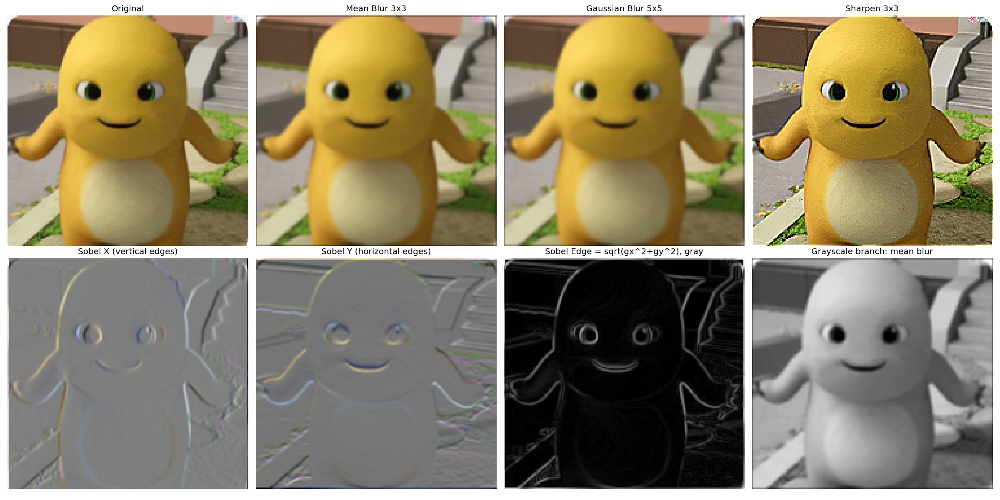

### 3.3 目视观察结论

- **均值模糊**：整体变柔，细节被均匀糊掉，"涂抹感"较强。
- **高斯模糊**：同样变柔，但过渡更自然，没有均值模糊那种生硬感。
- **锐化**：轮廓和毛发纹理明显变硬变清晰，同时浅色背景的噪点也被一起放大（锐化的副作用）。
- **Sobel-X**：呈现浮雕效果，突出**竖直方向**的轮廓。
- **Sobel-Y**：突出**水平方向**的轮廓（下巴、肩线）。
- **Sobel 合成边缘**：黑底白线，主体轮廓被完整勾勒，平坦区域接近全黑。

### 3.4 为什么均值与高斯卷积会让图片变模糊？

它们都是**加权平均**：均值核把每个像素换成周围 9 个像素的平均值；高斯核也是加权平均，只是中心权重大、周围权重小。

从频率角度，二者都是**低通滤波器**：平坦区域（低频）几乎不受影响，而突变区域（高频，也就是边缘和噪点）被强制拉平。像素之间原本的差异被"摊平"，视觉上就是模糊。

高斯核比均值核更好的原因：

1. 权重随距离**平滑衰减**，符合"邻近像素更相关"的直觉。
2. 没有锐利边界，不会产生均值核那种方块感和振铃效应。
3. **可分离**：二维高斯核可拆成两个一维高斯核先后作用，计算量从 `size²` 降到 `2×size`（5×5 从 25 次乘法降到 10 次）。

`sigma` 越大，权重分布越平缓，模糊越强。

### 3.5 为什么锐化会让边缘更明显？

锐化核可以拆成：

```text
5×中心 - 4 个邻居之和 = 原图 + (4×中心 - 邻居之和) = 原图 + 拉普拉斯(原图)
```

后半部分 `4×中心 - 邻居之和` 正是**拉普拉斯算子**（二阶微分），它度量的就是"这个像素和周围差多少"。所以 **锐化 = 原图 + 边缘信息**：边缘处拉普拉斯值大，叠加后对比更强；平坦区域拉普拉斯接近 0，几乎不变。

**注意核内和 = 1**（0−1+0−1+5−1+0−1+0 = 1）。核内和为 1 保证处理后**整体亮度不变**：大于 1 会整体变亮，小于 1 会整体变暗。这也是均值核要用 1/9 的原因（1/9×9 = 1）。

### 3.6 Sobel 卷积核为什么能找到边缘？

1. **Sobel-X 是左右差分**：右列和 − 左列和。左右亮度差别大（存在竖直边缘）的位置，结果绝对值就大。
2. **Sobel-Y 是上下差分**：下行和 − 上行和，对水平边缘敏感。
3. **中间行/列加权 2**：离中心更近的邻居贡献更大，相当于做了一次轻微平滑，对噪声不那么敏感。
4. **合成**：`edge = sqrt(gx² + gy²)` 是梯度向量的**模长**，与边缘方向无关，因此对**任意方向**的边缘都能响应。

**为什么用平方和开根号而不是直接相加**：`gx + gy` 会互相抵消——一条 +45° 的边缘 gx 为正、gy 为负，相加可能接近 0，边缘就"消失"了。

**Sobel 核的共同点：核内所有数之和 = 0**（实测打印为 0.000）。这表示"平坦区域输出为 0"，只有存在差异的地方才有非零响应——这正是边缘检测的本质，也解释了边缘图的背景是黑的。

**逐通道合成 vs 灰度合成**：实测中逐通道算梯度再整体归一化，会得到**彩色边缘**（三个通道的梯度强度不同，缩放不一致）。想得到黑白边缘图，应**先转灰度再合成**。本报告 `comparison.png` 里的 Sobel Edge 用的是灰度版，看起来就是干净的黑底白线。

---

## 四、valid 与 same：输出尺寸与边缘像素

### 4.1 计算公式

```text
H_out = floor((H_in + 2P - K) / S) + 1
W_out = floor((W_in + 2P - K) / S) + 1
```

### 4.2 实测输出尺寸

输入 `(178, 186, 3)`，3×3 均值核，`stride=1`：

```text
原图        ：(178, 186, 3)
valid 输出  ：(176, 184, 3)   高 -2，宽 -2
same  输出  ：(178, 186, 3)   尺寸不变
```

验证：valid `(178+0−3)/1+1 = 176`、`(186+0−3)/1+1 = 184` ✅；same（P = 3//2 = 1）`(178+2−3)/1+1 = 178`、`(186+2−3)/1+1 = 186` ✅。

### 4.3 边缘像素发生了什么变化（定量）

只比尺寸看不出代价，所以统计了输出图各行/列的通道均值：

```text
原图 顶行均值            161.02
valid 顶行均值           158.75   （由原图第 1~3 行算出，没有被 0 污染）
same  顶行均值           106.22   （由原图第 1 行 + 一行 0 算出，被压暗）
原图 底行均值             99.68
valid 底行均值           100.88
same  底行均值            66.60
valid 内部均值           123.82
same  内部均值           123.95   （内部两者几乎一致）
```

结论：**same 靠补 0 把边缘像素也纳入了窗口，内部结果和 valid 几乎一样（123.82 vs 123.95），代价是最外一圈输出被 0 拉低（顶行 161→106，底行 100→67）**，也就是边缘变暗、产生轻微失真。valid 不补 0、边缘更真实，但每卷一次就缩小 K−1 个像素，深层网络连续堆叠会快速塌缩。

### 4.4 卷积核大小 / padding / stride 与输出尺寸的完整实测表

```text
输入 (H,W) = (178,186)
   核K  padding  stride        公式输出          实际卷积输出
     3        0       1   (176, 184)       (176, 184)  OK
     3     same       1   (178, 186)       (178, 186)  OK
     3        0       2     (88, 92)         (88, 92)  OK
     3     same       2     (89, 93)         (89, 93)  OK
     5        0       1   (174, 182)       (174, 182)  OK
     5     same       1   (178, 186)       (178, 186)  OK
     7     same       1   (178, 186)       (178, 186)  OK
```

规律：

- **补 0 变多（P↑）或核变小（K↓）→ 输出变大；步长变大（S↑）→ 输出变小。**
- `padding="same"`（P = K//2）**只在奇数核 + stride=1 时**严格保持尺寸。
- 偶数核（如 K=4）用 P=2 反而会让输出变大 1；严格的 same 需要左右/上下不对称填充。
- `stride=2` 时 same 也只保证"边补够了"，输出仍是约一半（178→89）。

### 4.5 取舍

- **valid**：只对能完整容纳核的位置计算，输出更小、信息更"干净"（每个输出都由完整窗口算出），但每层都在缩小。
- **same**：可以自由堆叠卷积层而不用担心尺寸塌缩，代价是最外圈被人工补的 0 轻微污染。所以现代 CNN（VGG、ResNet 等）几乎都默认 same。

---

## 五、卷积后的数值应该怎样处理

### 5.1 会出什么问题

卷积结果是"像素值 × 核内权重"的加权和，可能出现：**负数**（锐化、Sobel 含负权重）、**大于 255**（锐化核中心是 5，浅色区域乘完很容易超）、**小数**（运算在 float32 下进行）。

而 `uint8` 的合法范围是 0~255 的整数。直接 `astype(np.uint8)` 会**溢出回绕**：260 变成 4、−3 变成 253，图上会出现莫名其妙的白点/黑点。

### 5.2 两种处理方式（按语义选）

| 场景 | 处理方法 | 原因 |
|---|---|---|
| 模糊 / 锐化等"**像素值**"结果 | `np.clip(x, 0, 255)` 后转 `uint8` | 语义就是亮度，超出范围直接截断 |
| 边缘强度、特征图等"**响应值**"结果 | 线性归一化到 0~255 | 数值范围未知，需要拉伸对比度才能显示 |
| 送入神经网络的中间特征 | **不转换**，保持 `float32` | 转换会丢精度并破坏梯度 |

边缘图必须用归一化而不是裁剪，实测原因很清楚：`gx/gy` 的输出范围是 `[0, 1039.4]`，如果直接 clip，大于 255 的部分全被截断成纯白，大量数值挤在小范围里显示出来几乎全黑，**对比信息丢失**；归一化把最弱的边缘映射到 0、最强的映射到 255，人眼才能看清完整结构。

归一化的代价是**逐图自适应**：换个内容，同一个边缘强度对应不同灰度值，所以它只适合可视化，不适合当定量数据。

---

## 六、灰度图分支（实测）

`conv2d_numpy()` 里写了灰度分支，本次用 `Image.open(...).convert("L")` 跑了一遍：

```text
灰度输入 shape=(178, 186)（只有 H、W，没有通道维）
conv2d_numpy 输出：valid=(176, 184)  same=(178, 186)
```

输出仍是二维，说明函数对 `(H, W)` 输入会自动补一维成 `(H, W, 1)` 处理、最后再 squeeze 回二维。**灰度图 = 1 个通道 = 二维数组；彩色图 = 3 个通道 = 三维数组**，这一区别在形状上直接可见。

灰度卷积结果保存在 `practice1_conv/outputs/gray_mean_blur.jpg`

---

## 七、手写卷积的性能观察

```text
178x178（  31684 个输出位置）:  0.12s
256x256（  65536 个输出位置）:  0.26s
512x512（ 262144 个输出位置）:  1.04s
彩色原图 5 次 same 卷积（178x186，5 个核）耗时 0.62s
```

位置数翻 4 倍，耗时也约翻 4 倍——这就是纯 Python 双重循环的特征。本次保留循环写法是为了**让卷积过程直观可见**；要实用应改成 `np.lib.stride_tricks.sliding_window_view` 把滑窗向量化。

---

## 八、实践一小结（踩坑记录）

1. **不要在有缩放的情况下引用旧数字**。开发过程中一度把图 `resize((256,256))` 提速，导致"原图尺寸"和 valid/same 输出尺寸的报告数字与实际脚本输出不一致。最终版脚本**不做任何缩放**，直接按原图 178×186 计算，所有形状与 `read_image.py` 完全对得上。
2. **`padding="same"` 不是万能的**：它只在奇数核 + stride=1 时保尺寸（见 4.4 的实测表）。
3. **卷积结果的显示方式要按语义选**：像素值用 clip，响应值用归一化（第五节），选错可能会出现"全黑"或"全白"。
4. **逐通道 vs 灰度**：Sobel 合成边缘时，逐通道算会得到彩色边缘，想要黑白边缘图要先转灰度。

---

# 实践二：训练猫狗分类器

## 一、观察数据集

### 1.1 规模

```text
dc/train 共 25000 张：cat 12500 张，dog 12500 张
dc/test  共 12500 张（无标签，仅用于推理演示）
```

两个类别完全均衡，因此不需要类别加权或重采样。划分方式：从有标签的 `dc/train` 里按 **70/15/15 分层抽样**（`split_data.py`，固定 seed=42），得到：

| split | cat | dog | 合计 | 用途 |
|---|---|---|---|---|
| train | 8750 | 8750 | 17500 | 训练 |
| val | 1875 | 1875 | 3750 | 选模型 / 调参 |
| test | 1875 | 1875 | 3750 | 最终评估，只用一次 |

`dc/test` 的 12500 张无标签图片不参与训练和评估，只用于最终推理演示（`predict.py`）。

### 1.2 图片尺寸极其不统一（全量 25000 张实测）

| 指标 | min | 25% | 中位数 | 75% | max | 均值 |
|---|---|---|---|---|---|---|
| 宽 W | 42 | 323 | 447 | 499 | 1050 | 404.1 |
| 高 H | 32 | 301 | 374 | 421 | 768 | 360.5 |
| 宽高比 W/H | 0.3 | 0.9 | 1.3 | 1.3 | 5.9 | 1.2 |
| 像素数 W×H | 1900 | 106000 | 175149 | 187125 | 785664 | 151188 |

- 颜色模式统计：`{'RGB': 25000}`，没有灰度图或带 alpha 的图。
- **宽高完全相同的（正方形）只有 70 张，占 0.3%**；最大的图 (1050×702) 像素数是最小的图 (约 1900) 的 **400 多倍**。

**结论**：尺寸差异巨大且绝大多数不是正方形，所以必须统一 resize；又因为直接拉伸会扭曲物体长宽比，所以用 `Resize + CenterCrop`（评估）和 `RandomResizedCrop`（训练）而不是简单 `Resize`。

### 1.3 清晰度、亮度、背景差异也很大（随机 800 张实测）

| 指标 | min | 中位数 | 均值 | max |
|---|---|---|---|---|
| 亮度均值 | 41.6 | 118.0 | 118.6 | 223.0 |
| 对比度（灰度 std） | 17.5 | 55.0 | 55.1 | 101.7 |
| 清晰度（拉普拉斯方差） | 100.3 | 899.6 | 1152.6 | 8530.2 |

亮度跨 41~223、清晰度跨 100~8530，说明**拍摄背景、光照条件、清晰度差异明显**。这是需要归一化、并且适合用颜色扰动/裁剪类数据增强的原因。

### 1.4 随机样例

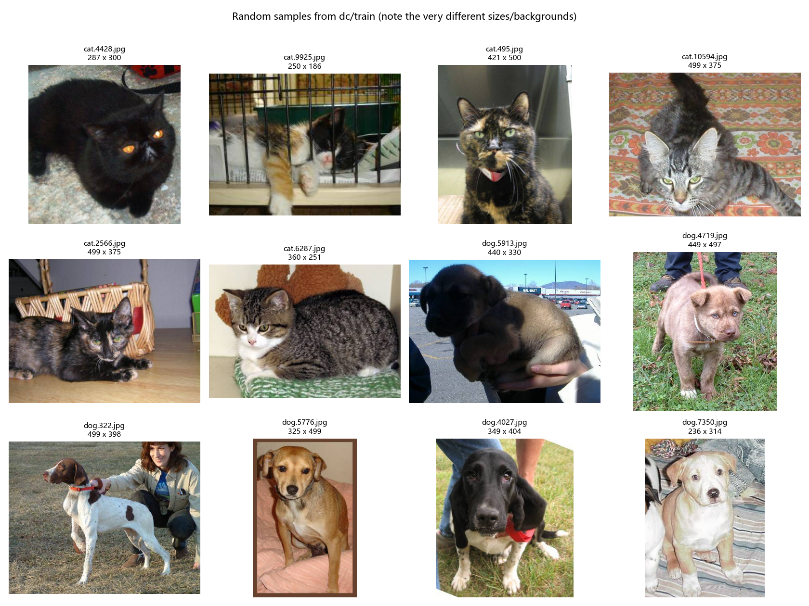

12 张随机原图（6 猫 6 狗），标题写着各自的原始尺寸，印证上面的统计。

---

## 二、数据读取与预处理

### 2.1 读取方式

用 `torchvision.datasets.ImageFolder` 直接读取 `data_split/{train,val,test}/{cat,dog}` 结构，类别映射由目录名自动得到：`{'cat': 0, 'dog': 1}`。

### 2.2 三条流水线

| 用途 | 流水线 |
|---|---|
| **训练** | `Resize(160) → RandomResizedCrop(128, scale=(0.7,1.0)) → RandomHorizontalFlip(0.5) → ColorJitter(0.2,0.2,0.2) → ToTensor → Normalize` |
| **训练（强化版）** | `Resize(176) → RandomResizedCrop(128, scale=(0.5,1.0)) → RandomHorizontalFlip(0.5) → RandomRotation(10) → ColorJitter(0.3,0.3,0.3) → ToTensor → Normalize → RandomErasing(0.5)` |
| **验证/测试/推理** | `Resize(144)（短边缩放，保持长宽比） → CenterCrop(128) → ToTensor → Normalize` |

归一化统一使用 ImageNet 的 `mean=[0.485,0.456,0.406]`、`std=[0.229,0.224,0.225]`。

**关键原则：验证/测试集不能做随机增强**。

### 2.3 batch 是怎么组成的

`DataLoader` 每次取 `batch_size=32` 张已经预处理好的图，堆叠成一个四维张量：

```text
一个 batch 的形状: (32, 3, 128, 128)   # (N, C, H, W)，float32
标签的形状:        (32,)               # 0=cat, 1=dog
```

- `shuffle=True`（仅训练集）：打乱顺序，避免同类样本总是连续出现影响梯度方向。
- `drop_last=True`（仅训练集）：丢掉最后一个不满 32 的 batch，让 BatchNorm 每批的统计量更稳定。
- 验证/测试集 `shuffle=False`、`drop_last=False`：保证每个样本都被评估到、且顺序可复现。

### 2.4 预处理前后对比（检查拉伸 / 裁剪错误 / 颜色异常）

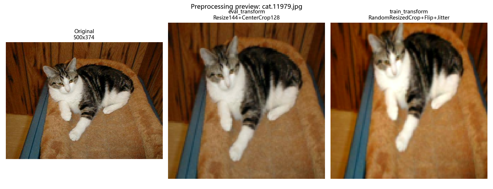

- **原图**保留原始长宽比（例：cat.11979 原图 500×374，宽高比 1.34）。
- **eval_transform**：先把**短边**缩放到 144（保持长宽比），再中心裁剪 128，所以物体的形状不会变；归一化再反归一化显示后与原图一致，**没有颜色异常**。
- **train_transform**：`RandomResizedCrop` 会随机选一块区域再缩放，所以同一张图每次取景都不同——这是有意为之，不是 bug。

#### 这里发现并修掉了一个真实的"拉伸"问题

初版 `eval_transform` 写的是 `Resize((144,144))`（元组），它把任意长宽比的图**强行拉成正方形**。本数据集宽高比实测跨 0.3~5.9，500×374 的图会被横向压扁约 25%——`predict.png` 里那只 288×499 的狗被压得明显"变胖"。

改成 `Resize(144)`（只写一个数字 = 短边缩放，长边按比例缩放）后不再拉伸，这与 torchvision 官方 ImageNet 流程（`Resize(256) → CenterCrop(224)`）一致。为量化这个差别，用同一个模型在测试集上分别评估两种预处理：

```text
python analyze_errors.py --ckpt outputs/best_full_aug.pt --split test --transform stretch
python analyze_errors.py --ckpt outputs/best_full_aug.pt --split test --transform crop
```

| 预处理 | 做法 | val acc | test acc | test 混淆矩阵 |
|---|---|---|---|---|
| `Resize((144,144))`（初版，**会拉伸**） | 强行拉成正方形：保留全部内容，但改变物体形状 | 0.9573 | **0.9592** | `[[1793,82],[71,1804]]` |
| `Resize(144)` + `CenterCrop(128)`（最终版，**不拉伸**） | 短边缩放、长边按比例，再裁掉长边约 11% | 0.9501 | **0.9528** | `[[1790,85],[92,1783]]` |

**结果有点反直觉**：不拉伸的版本反而低了 0.64 个百分点（3750 张里多错约 24 张）。原因有两层：

1. `Resize(144)` 之后 `CenterCrop(128)` 会裁掉长边约 16/144 ≈ 11% 的内容，猫狗的头部或尾巴有时正好被裁掉；而拉伸虽然变形，却把整张图都保留了下来。
2. 训练用的是 `RandomResizedCrop`，模型对一定程度的形变本来就有容忍度。

3750 张测试集上 24 张的差距**不足以判定两者谁绝对更好**（同一个模型在不同预处理下的 `|Δ|` 只相当于 0.6% 的错误率变化）。最终仍然选择**不拉伸**的版本，理由是：变形是一种已知的、与自然拍摄分布不符的分布偏移，它在这份数据上碰巧略好，但没有稳定的受益机理，换一批数据很可能反转；而"短边缩放 + 中心裁剪"是通用做法。

> 下面所有分析（§7 的错分统计、特征图、推理演示）都基于**最终版不拉伸预处理**，因此那里主模型的准确率是 **0.9528**，与 `log_full_aug.txt` 里记录的 0.9592（当初用拉伸预处理跑出来的）不同。

> 检查要点：预处理后的图里猫狗主体仍完整可辨、颜色没有偏色、形状没有被拉伸成"宽脸/长脸"，说明流水线正确。

> 教训：`transforms.Resize((144,144))` 和 `transforms.Resize(144)` 只差一对括号，含义完全不同——前者固定尺寸但会变形，后者保持长宽比。写预处理时一定要确认传的是元组还是单个整数。

---

## 三、CNN 结构

### 3.1 结构图

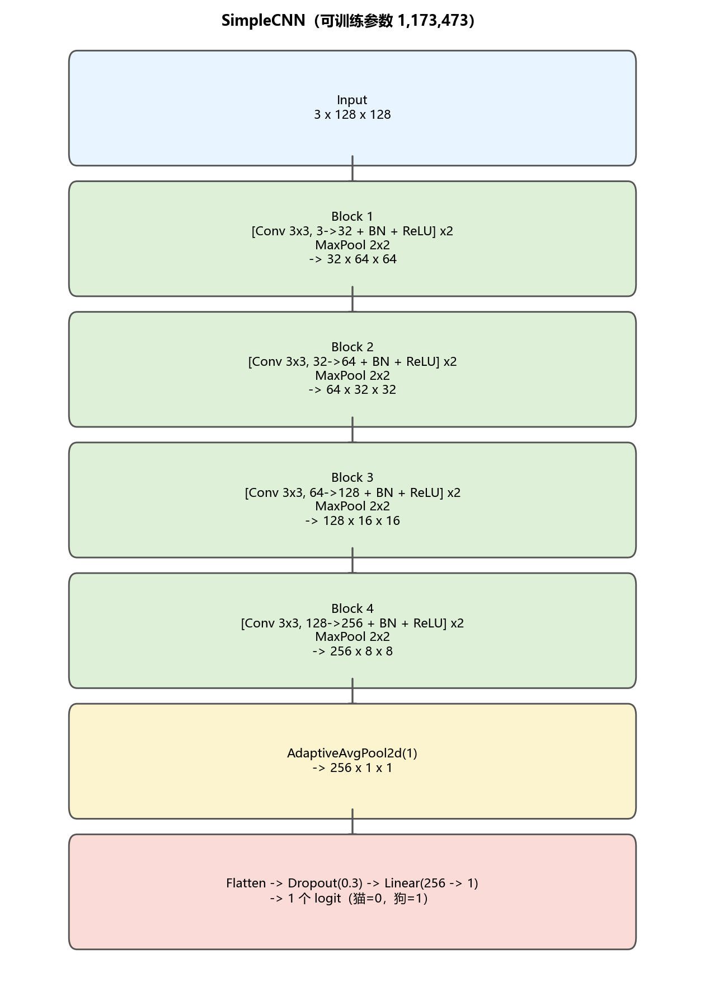

```
Input 3×128×128
  └─ Block1: [Conv3x3(3→32) + BN + ReLU] ×2 + MaxPool2x2  → 32×64×64
  └─ Block2: [Conv3x3(32→64) + BN + ReLU] ×2 + MaxPool2x2 → 64×32×32
  └─ Block3: [Conv3x3(64→128) + BN + ReLU] ×2 + MaxPool2x2 → 128×16×16
  └─ Block4: [Conv3x3(128→256) + BN + ReLU] ×2 + MaxPool2x2 → 256×8×8
  └─ AdaptiveAvgPool2d(1)                                  → 256×1×1
  └─ Flatten → Dropout(0.3) → Linear(256→1)                → 1 个 logit
```

用了卷积层、ReLU 激活、最大池化、批归一化和全局平均池化，二分类输出 1 个 logit（配 `BCEWithLogitsLoss`）。

### 3.2 一张图片经过各层后的形状变化（`model_arch.py` 实测）

| 位置 | 层 | 输出形状 | 参数 |
|---|---|---|---|
| input | 输入图片 | (1, 3, 128, 128) | 0 |
| features[0][0] | Conv2d | (1, 32, 128, 128) | 864 |
| features[0][1] | BatchNorm2d | (1, 32, 128, 128) | 64 |
| features[0][3] | Conv2d | (1, 32, 128, 128) | 9,216 |
| features[0][6] | MaxPool2d | (1, 32, 64, 64) | 0 |
| features[1][0] | Conv2d | (1, 64, 64, 64) | 18,432 |
| features[1][3] | Conv2d | (1, 64, 64, 64) | 36,864 |
| features[1][6] | MaxPool2d | (1, 64, 32, 32) | 0 |
| features[2][0] | Conv2d | (1, 128, 32, 32) | 73,728 |
| features[2][3] | Conv2d | (1, 128, 32, 32) | 147,456 |
| features[2][6] | MaxPool2d | (1, 128, 16, 16) | 0 |
| features[3][0] | Conv2d | (1, 256, 16, 16) | 294,912 |
| features[3][3] | Conv2d | (1, 256, 16, 16) | 589,824 |
| features[3][6] | MaxPool2d | (1, 256, 8, 8) | 0 |
| gap | AdaptiveAvgPool2d | (1, 256, 1, 1) | 0 |
| classifier | Dropout + Linear | (1, 1) | 257 |
| **合计可训练参数** | | | **1,173,473** |

**宽、高、通道的变化**：

- **宽高**：每个 Block 里的两次 3×3 卷积（padding=1，same）**不改变尺寸**；`MaxPool2d(2)` 把尺寸**减半**。所以 128 → 64 → 32 → 16 → 8。
- **通道**：32 → 64 → 128 → 256，逐层翻倍，由该层卷积核的**个数**决定。
- 最后 `AdaptiveAvgPool2d(1)` 把 8×8 的空间信息压成 1×1，通道数不变（256），再接 `Linear(256→1)`——这样输入尺寸变化时全连接层不用改。

---

## 四、训练与结果

### 4.1 训练设置

| 项目 | 设置 |
|---|---|
| 损失函数 | `BCEWithLogitsLoss`（内部自带 sigmoid，数值稳定） |
| 优化器 | `AdamW`，lr=1e-3，weight_decay=1e-4 |
| 学习率调度 | `CosineAnnealingLR`（余弦退火到 0） |
| batch size | 32 |
| 轮数 | 主实验 20 epoch；对照实验 15 epoch |
| 选模型 | 按**验证集准确率**保存最优权重；测试集只在最后评估一次 |

### 4.2 主实验（全量 17500 张，20 epoch，带默认增强）

| 指标 | 数值 |
|---|---|
| 可训练参数量 | 1,173,473 |
| best val acc | **0.9573**（第 18 个 epoch） |
| 对应 train acc | 0.9631（train–val 差距仅 0.0058） |
| test acc | **0.9592** |
| test 混淆矩阵 `[真实][预测]` | `[[1793, 82], [71, 1804]]` |

> **预处理版本说明**：这次训练（即 `log_full_aug.txt`）用的是初版 `Resize((144,144))` 预处理。用最终版"不拉伸"预处理重新评估同一份权重，得到 **val 0.9501 / test 0.9528**（两版逐项对比见 §2.4）。本报告 §7 的错分分析全部基于最终版预处理，因此那里主模型的准确率是 0.9528。

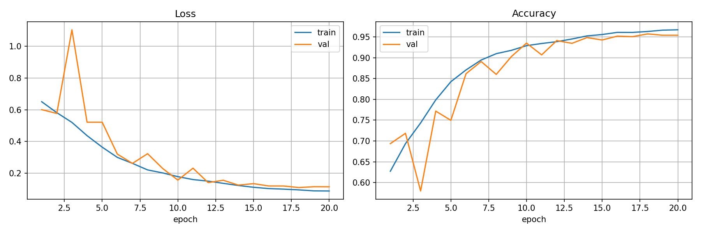

曲线表现良好：训练 loss 20 个 epoch 内从 0.65 平滑降到 0.088，验证 loss 同步下降到 0.11 左右，train/val 准确率曲线几乎贴在一起（0.9672 vs 0.9541），**没有明显过拟合**。第 3 个 epoch 出现过一次 val loss 尖峰（1.10），随后迅速恢复，属于训练早期的正常波动。

> 注：主实验产出于给 `train.py` 加入 `--seed` 选项之前，因此它**没有固定随机种子**；后面所有对照实验、基线实验、改进实验都固定了 `seed=42`，可复现。

### 4.3 对照实验：有增强 vs 无增强（同一子集、同一 seed）

为了隔离"数据增强"这一个变量，在每类 2000 张的子集（train 2800 / val 600 / test 600）上，用**完全相同的设置、相同的 seed=42**跑了两次，唯一区别是训练集是否做随机增强：

| 实验 | best val acc | 对应 train acc | train−val 差距 | test acc | test 混淆矩阵 |
|---|---|---|---|---|---|
| **有增强** | 0.7950（第 15 epoch） | 0.7870 | **−0.008** | 0.7617 | `[[242,58],[85,215]]` |
| **无增强** | 0.8217（第 15 epoch） | 0.9116 | **+0.0899** | 0.8167 | `[[258,42],[68,232]]` |

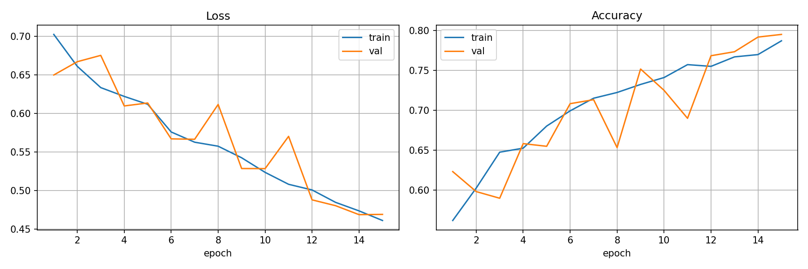
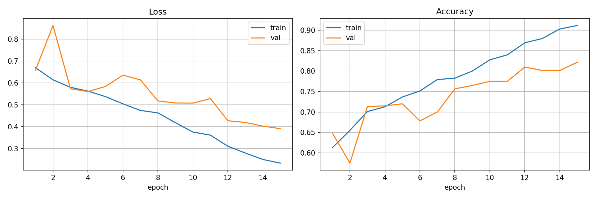

**结论**：

1. **增强确实起到了正则化作用**：无增强时 train acc 冲到 0.9116、val 只有 0.8217，**train–val 差距 9.0 个百分点 = 典型过拟合**；有增强时 train 0.7870、val 0.7950，差距几乎为 0（甚至为负，说明验证集那时还略好于训练集）。
2. **但在这个预算下增强的绝对准确率更低**（test 0.7617 vs 0.8167）。原因是 `train_transform` 里的 `RandomResizedCrop(scale 0.7~1.0) + ColorJitter + Flip` 让训练样本显著变难，15 个 epoch 还没收敛（有增强的 train acc 只有 0.787，而无增强已经 0.912）。**它是"欠拟合"，不是"增强有害"**——把训练拉长，两者应该会反过来。
3. 两次实验固定了同一个 seed=42、同一份数据划分、同一套超参，唯一变量就是增强，因此上面的差距可以归因到增强本身。
4. **遗留问题**：本次没有在全量数据上单独跑一次"无增强"作为对照（受时间预算限制），所以"全量数据下增强是否提升绝对准确率"没有直接实验证据。不过全量主实验（§4.2）在默认增强下达到 train 0.9672 / val 0.9541，**train–val 差距只有 1.3 个百分点**，说明在 17500 张时过拟合已经不再是主要矛盾。

### 4.4 子集 vs 全量

| 数据规模 | test acc（最终预处理口径） |
|---|---|
| 子集：每类 2000 张（train 2800） | 0.7617（有增强）/ 0.8167（无增强） |
| 全量：每类 8750 张（train 17500） | **0.9528** |

训练数据增加 6.25 倍，准确率提升约 14~19 个百分点。说明**这个网络本身的容量是够的，瓶颈是数据量**。

---

## 五、特征图可视化

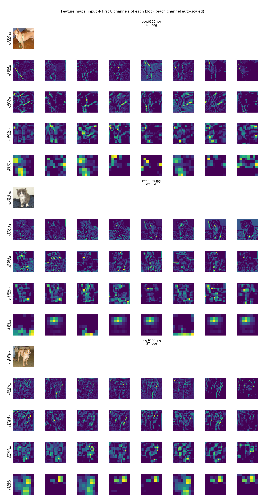

从测试集随机抽 3 张（dog.8320 / cat.8225 / dog.8100），每张图展示 **输入 + 4 个 Block 的前 8 个通道**，行标签同时标出该 Block 输出张量的形状。

**不同通道对同一张图产生了什么结果？**

- **block1（32×64×64）**：分辨率还很高，通道之间差异明显——有的通道响应"物体的外轮廓"，有的响应"毛发/草地的细纹理"，有的几乎只对背景亮暗敏感；同一物体在不同通道里的亮区位置不同。这说明**浅层卷积核相当于各种方向的边缘/纹理检测器**，学到的还是低频的、颜色与边缘层面的信息。
- **block2（64×32×32）**：空间分辨率降到一半，响应变成块状，开始出现"局部结构"（耳朵、眼睛、口鼻附近的高响应区），不再像 block1 那样是细线条。
- **block3（128×16×16）**：基本看不出原图轮廓，只有零散的语义块。
- **block4（256×8×8）**：只有 8×8，人眼已无法辨认，但可以看到**不同通道的高响应位置明显不同**——有的通道在图像中央亮、有的在下部亮，说明通道已经分化成"对某类部位/语义敏感"的检测器（全局平均池化后，每个通道就是一个"该语义存在与否"的分数）。

整体规律与直觉一致：**浅层关注颜色、边缘和纹理，深层关注更大范围的、更抽象的语义**；同时空间尺寸逐层减半、通道数逐层翻倍，正是"空间信息 → 语义信息"的转换过程。

> 展示方式说明：每个通道单独做最大最小归一化后再上色（viridis），因此**不能横向比较不同通道的绝对数值大小**，只能比较"同一通道内哪里响应强、不同通道响应模式是否不同"。

---

## 六、数据增强对照实验

### 6.1 增强了哪些变换，为什么

| 变换 | 参数 | 合理性分析 |
|---|---|---|
| `RandomResizedCrop` | scale 0.7~1.0（强化版 0.5~1.0） | 合理。真实拍摄中主体大小、取景范围本来就不同；裁剪也逼迫模型别只依赖单一部位。但 scale 过低会切掉主体（见 6.3）。 |
| `RandomHorizontalFlip` | p=0.5 | **对猫狗完全安全**：猫狗左右翻转后类别不变，是最"免费"的增强。 |
| `ColorJitter` | brightness/contrast/saturation 0.2~0.3 | 合理。数据集亮度实测跨 41~223，颜色扰动正好模拟不同光照。过强会导致颜色失真。 |
| `RandomRotation` | ±10° | 合理。小幅旋转模拟拍摄角度，猫狗没有"朝向语义"（不像数字 6/9、字母 b/d）。 |
| `RandomErasing` | p=0.5，面积 2%~20% | 有风险。能迫使模型看更多区域、抗遮挡，但抹掉的很可能是关键部位（如整张脸）；且论文原版用随机像素值填充，视觉上比较突兀。 |

### 6.2 增强后的样本

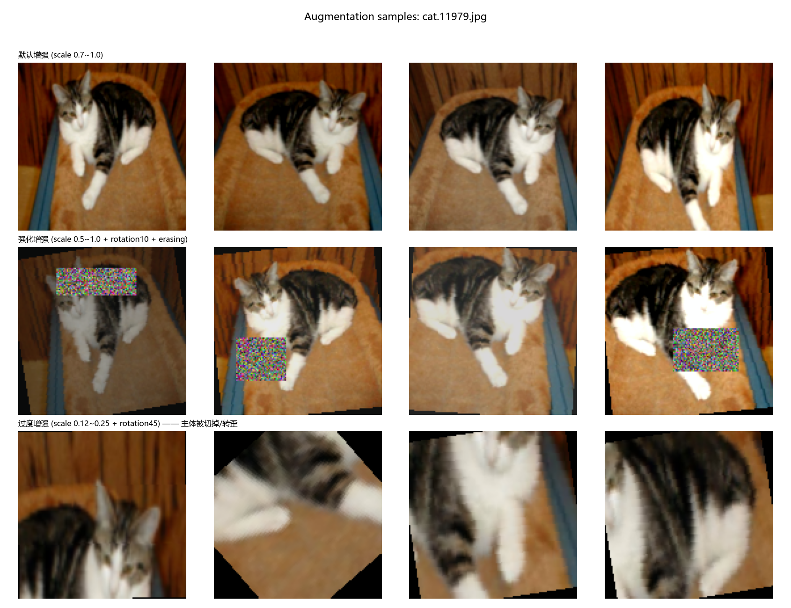

同一张图（cat.11979）的三行对比：

- 第 1 行**默认增强（scale 0.7~1.0）**：主体始终完整，只是取景和颜色略有变化——**安全的增强**。
- 第 2 行**强化增强（scale 0.5~1.0 + 旋转 10° + 随机擦除）**：角度和取景变化更大，还出现了被随机像素块遮住一角的情况——**多样性更高，但已经开始有"遮挡关键部位"的风险**。
- 第 3 行**过度增强（scale 0.12~0.25 + 旋转 45°）**：只剩一块皮毛或半只耳朵，**猫的特征已被完全破坏**——这种变换会让"猫"和"狗"的局部纹理变得无法区分，等于给模型灌入噪声标签。

### 6.3 哪些变换合理、哪些会破坏标签或让图片失真

**合理的**：水平翻转（猫狗对称，零风险）、小幅颜色扰动（光照差异客观存在）、适度缩放裁剪（模拟取景差异）、小幅旋转。

**有风险的**：
- **过度裁剪**：把主体裁掉大半，剩下的信息可能指向错误类别。这题的猫狗都可能有"毛茸茸"的局部纹理，裁到只看纹理时标签就失效了。
- **大角度旋转**：猫狗本身不敏感，但 ±90° 会让画面出现黑边/填充，且与自然拍摄分布不符。
- **过强颜色扰动**：可能把黑猫变成棕色、把花色洗掉，破坏区分依据。
- **随机擦除**：遮住整张脸时，样本的信息量可能不足以判断类别。

**为什么不能用在验证/测试集**：增强会改变样本分布，同一张图每次评估得到不同输入，指标不可复现；更重要的是，裁剪/旋转可能切掉类别线索，会把"模型能力"和"评估噪声"混在一起。验证/测试集只做确定性的 `Resize + CenterCrop + Normalize`，才能稳定、公平地衡量泛化能力。

---

## 七、错误样本分析与改进

### 7.1 先修正分析方法

原来的 `analyze_errors.py` 是"从头顺序扫描、凑够 n 张错分样本就停"。但 `ImageFolder` 按类名排序，`cat.*` 全部排在 `dog.*` 前面，所以**画出来永远是清一色的 `GT:cat Pred:dog`**——`dog→cat` 的错误一张都看不到，很容易得出错误结论。

修正后的流程：**先扫完整个 split 得到混淆矩阵，再从两类错误里各取一半**按模型自信程度排序展示。

### 7.2 主模型在测试集上的完整表现（全量 3750 张，实测）

```text
=== 混淆矩阵 [真实][预测]（0=cat, 1=dog）===
            预测cat  预测dog
  真实cat     1790      85
  真实dog       92    1783

  总体准确率 : 0.9528  (3573/3750)
  cat 召回率 : 0.9547    cat 精确率: 0.9511
  dog 召回率 : 0.9509    dog 精确率: 0.9545
  错分总数   : 177
    cat -> dog: 85 张
    dog -> cat: 92 张
```

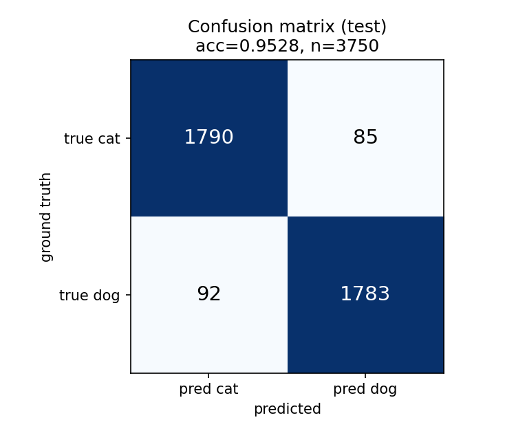

两类错误数量几乎相等（85 vs 92），**没有类别偏置**，模型不是"倾向于猜狗"。

验证集（3750 张）上是 0.9501，混淆矩阵 `[[1776, 99], [88, 1787]]`，同样是两类错误接近。两个 split 结论一致，说明模型在两个方向上犯错的概率基本相同。

### 7.3 阈值扫描：0.5 是不是最佳阈值？

```text
      阈值      acc  cat->dog  dog->cat
    0.30   0.9477       143        53
    0.40   0.9520       111        69
    0.45   0.9533        98        77
    0.50   0.9528        85        92
    0.55   0.9531        72       104
    0.60   0.9533        60       115
    0.70   0.9456        49       155
  概率分布: 均值 0.498，中位数 0.484
  错分样本的 |p-0.5| 中位数: 0.238
```

- 概率均值 0.498、中位数 0.484，基本对称，**没有类别偏置**。
- 把阈值从 0.5 调到 0.45 或 0.60，准确率只从 0.9528 变成 0.9533（多对 2 张），**属于噪声级别的提升**，代价却是错误结构被明显扭曲（阈值 0.60 时 `dog→cat` 从 92 张涨到 115 张）。所以**保留 0.5**。
- 错分样本的 `|p−0.5|` 中位数是 0.238，说明**一半左右的错分样本模型其实"很不确定"**；但也有一批 `|p−0.5| → 0.5` 的高置信错分样本（见 7.4 第 1 条），它们才是真正值得追查的。

### 7.4 错分样本长什么样

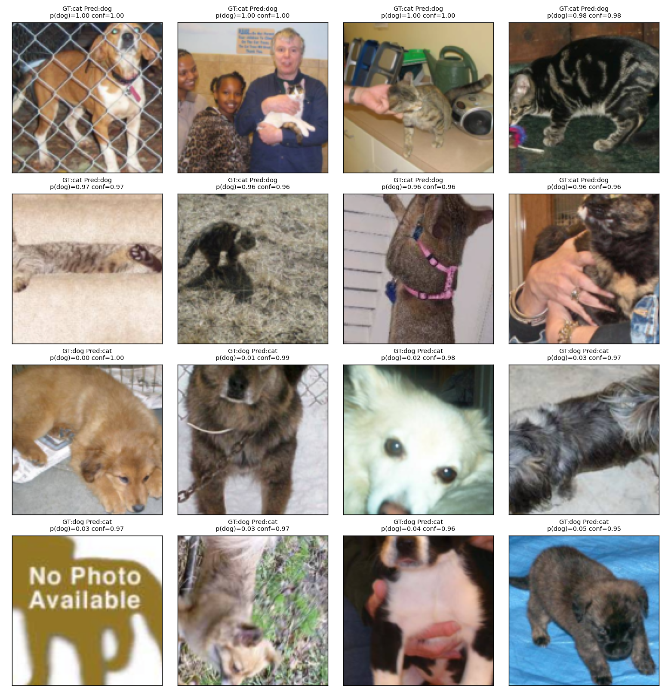

上排 8 张是 `cat→dog`，下排 8 张是 `dog→cat`，都按"模型越自信越靠前"排列。观察到的典型类型：

1. **数据/标签噪声（最致命）**：
   - `cat.4085.jpg` 是一只被铁栏挡着的比格犬，标签却是 cat，模型给 p(dog)=1.000——**模型是对的，标签是错的**。
   - 第 4 行第 1 张是一张 **"No Photo Available" 的占位图**（一张带狗剪影的图形，不是真实照片），标签是 dog，模型给 p(dog)=0.00。数据集里混进了非照片素材，这类样本是纯粹的噪声。
   - 这些样本无论模型多好都学不会，是准确率的**天花板**。它们在各次实验（主实验、改进实验、不同预处理口径）里都稳定出现在"最自信错分"前列，正好证明问题出在数据而不是模型。
2. **本质难分的相似样本**：`dog→cat` 里大量是小型/长毛/白色犬（像猫一样的圆脸、小体型），或者反过来花色像狗的猫。
3. **不寻常的构图**：好几张被高置信度判成 dog 的其实是猫——比如趴在厨房台面上、被人抱在怀里、趴在沙发扶手上。这些图里猫只占画面一小部分、背景杂物很多，模型的注意力被背景带偏了。
4. **遮挡与奇特姿态**：被笼子/栅栏挡着、只露出局部、躺卧蜷缩、从背后拍。
5. **画质/构图差**：画面很暗、模糊、主体只占很小一块、分辨率不足。

### 7.5 改进尝试

根据上面的分析，最有希望的方向是"**让模型不要依赖单一显著部位、增强对遮挡/姿态/光照的鲁棒性**"，因此把训练增强加强（`dataset.py` 的 `strong_train_transform`）：

| 改动 | 原设置 | 改进设置 | 对应上面的哪类错误 |
|---|---|---|---|
| 裁剪范围 | scale 0.7~1.0 | scale **0.5**~1.0 | 主体大小不一、只露出局部 |
| 旋转 | 无 | **RandomRotation(10)** | 姿态奇特 |
| 颜色扰动 | 0.2 | **0.3** | 光照差异大 |
| 随机擦除 | 无 | **RandomErasing(0.5, 2%~20%)** | 遮挡 |

为保证只有"增强强度"这一个变量变化，改进实验的数据、轮数、优化器、学习率、种子都与主实验保持一致（全量 17500 张、20 epoch、seed=42）。

#### 结果：改进**没有**生效，准确率反而下降

两者都用最终版"不拉伸"预处理评估，口径完全一致：

| 对比项 | 主实验（默认增强） | 改进实验（强化增强，seed=42） |
|---|---|---|
| test acc | **0.9528** | **0.9304**（−2.24pp） |
| 错分总数 | 177 | **261** |
| cat→dog / dog→cat | 85 / 92 | 124 / 137 |
| best val acc | 0.9573（拉伸口径） / 0.9501（最终口径） | 0.9299 |
| 最后 epoch 的 train acc | 0.9672 | 0.9014 |
| best 出现的 epoch | 18 / 20 | **19 / 20** |

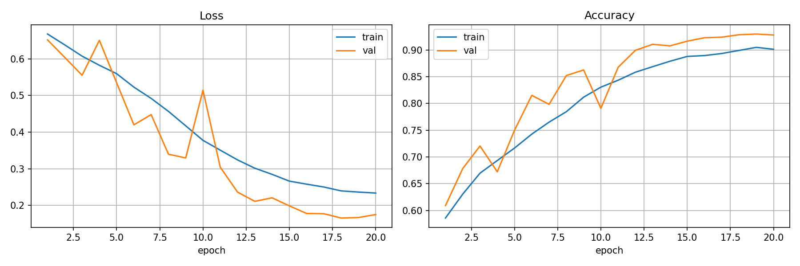
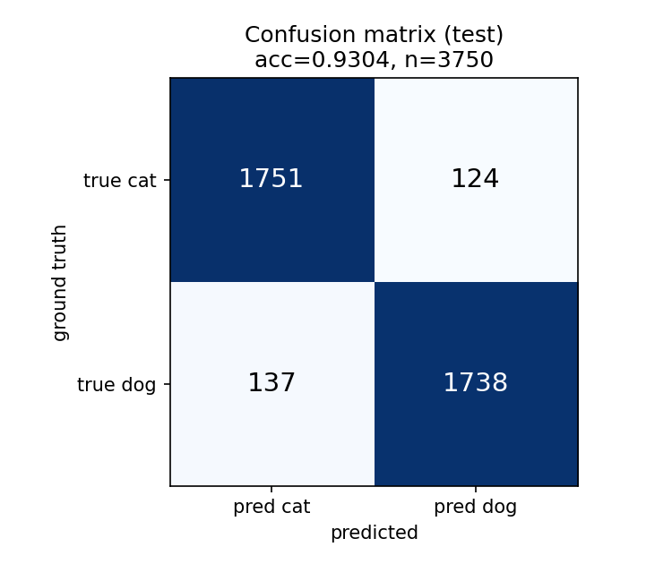

#### 为什么反而变差了？

1. **增强过强导致欠拟合**。强化增强下第 20 个 epoch 的 train acc 只有 0.9014（主实验 0.9672），而且 best 出现在第 19/20 个 epoch——**曲线还在上升**。也就是说这个模型是"没学够"，不是"学过头"。
2. **`RandomErasing` 可能抹掉关键部位**。p=0.5、面积最多 20%，猫狗的头部经常被整块随机噪声盖住（见 `augment_preview.png` 第 2 行），这时样本本身的信息量不足以判断类别，等于往训练集里掺了一批"无法判断"的样本。
3. **训练分布被推得离真实分布太远**。训练图被剪得更碎、转得更多、糊得更花，而验证/测试只做最朴素的缩放裁剪，两头分布差距变大，验证指标就掉了。
4. 相比之下，**主实验的默认增强强度（翻转 + scale 0.7~1.0 + 0.2 颜色扰动）在这份数据量下更合适**：它已经把 train–val 差距压到 1.3 个百分点，说明正则化需求已经基本满足。

#### 这次失败的收获

- 它**证伪了"增强越强越好"的直觉**：增强强度和模型容量、训练轮数、数据量是耦合的，单独调高增强强度只会让欠拟合更严重。
- 它**定位出了当前模型的真正瓶颈不在过拟合**（主实验 train 0.9672 / val 0.9541，差距很小），而在**数据与标签本身**：`cat.4085.jpg` 这类标错的样本、"No Photo Available" 占位图，以及"小型长毛犬 ↔ 猫"这类本质难分的样本。
- 因此下一步更值得做的**不是**继续加强增强，而是：清洗标签噪声样本、用预训练模型微调、提高输入分辨率、或先跑更久再看增强的收益。
- 另外，改进实验的 `RandomErasing` 用的是论文原版的"随机像素填充"，视觉上会产生很突兀的彩色噪声块（`augment_preview.png` 可见）。工程上更常见的做法是用 0 或数据集均值填充，或者降低 p 和面积上限。**如果重做，我会把 `RandomErasing` 的 p 从 0.5 降到 0.2、面积上限从 20% 降到 10%，并保持其他项不变。**

> 说明：主实验那次训练没有固定种子，改进实验固定了 seed=42，所以 2.24pp 里含少量随机性成分；但两者在 train acc（0.9672 vs 0.9014）和错分数（177 vs 261）上的差距是同量级的，结论方向可靠。

---

## 八、独立推理程序

`predict.py` 是一个不依赖训练脚本的独立程序，输入一张本地图片即可输出结果：

```text
输入图片 : dc/test/1000.jpg  原始尺寸(宽,高)=(288, 499) mode=RGB
预处理   : Resize(144)（短边缩放到 144，保持长宽比）-> CenterCrop(128) -> ToTensor -> Normalize
送进网络的张量: shape=(1, 3, 128, 128) dtype=torch.float32 值域[-1.91, 2.64]（已按 ImageNet 均值方差归一化）
----------------------------------------------------
预测结果 : 狗（dog）
预测概率 : 0.9761   [p(dog)=0.9761, p(cat)=0.0239]
----------------------------------------------------
预处理后的图片保存到 outputs/predict_processed.png
可视化保存到 outputs/predict.png
```

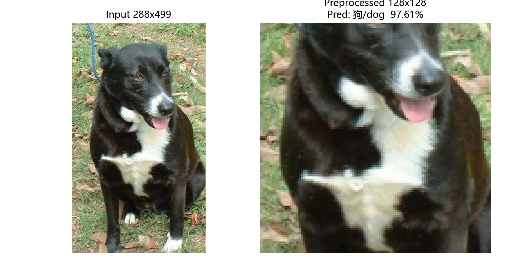

要点：

- **预处理与训练时完全一致**（复用 `dataset.eval_transform`）。这是独立推理最容易出错的地方——如果推理时忘了归一化、或用了不同的 resize，输入分布就会偏，预测会明显失准。
- 输出类别用**中文"猫/狗"**，同时给出两个方向的概率。
- 输出"处理后的图片"：`predict_processed.png` 就是真正送进网络的那张 128×128 图（反归一化后可显示），另有左右对比图 `predict.png`。

---

## 九、模型结构图

见 3.1 节的 `model_arch.png`（由 `model_arch.py` 生成，标注了每个 Block 的输出形状与总参数量）。

---

# 趁热打铁

## 1. 卷积层为什么比直接用一个巨大的全连接层更适合处理图片？

三个核心原因：

1. **参数共享**：一个 3×3 卷积核只有 9 个权重，却在整张图的所有位置复用。全连接层要为每个位置单独学一套权重。
2. **局部连接 / 局部性先验**：图像的相关性主要发生在邻近像素之间，卷积天然只看局部邻域。
3. **平移等变**：无论猫出现在左上角还是右下角，同一个卷积核都能检测到同样的特征。

**实测对比**（在完全相同的子集、相同 batch/epoch/优化器/种子下，只把网络换成全连接）：

| 对比项 | CNN（SimpleCNN） | 全连接（MLP, hidden=512） |
|---|---|---|
| 参数量 | 1,173,473 | **25,166,849**（**21.4 倍**） |
| best val acc | 0.7950 | **0.6400**（第 14 个 epoch） |
| test acc | 0.7617 | **0.6333**（低 12.8 个百分点） |
| test 混淆矩阵 | `[[242,58],[85,215]]` | `[[210,90],[130,170]]` |
| 第 1 个 epoch 的 train loss | 0.70 | **8.27** |
| 平均每 epoch 耗时 | ~32s | ~32s |

（两者用同一份 `data_split_sub2000`、同样 15 epoch、同样 `AdamW lr=1e-3`、同样 `seed=42`、同样默认数据增强，只换了网络结构。）

**结论**：

- **参数多 21.4 倍，准确率反而低 12.8 个百分点。** 多出来的参数没有换来性能，反而因为缺少"局部连接 + 权重共享"这个归纳偏置，全连接层必须为每个像素位置单独学一套权重，2800 张训练样本根本喂不饱它，很快就转到记住训练集上去。
- **更难优化。** 全连接基线第 1 个 epoch 的 train loss 高达 **8.27**（CNN 是 0.70），前几个 epoch 都在从很大的数值往下掉，说明 `Flatten → Linear(49152→512)` 这种结构在这个尺度上很难起步。
- **在这套管线下并没有更慢。** 两者每 epoch 都是 ~32 秒，因为瓶颈在 CPU 端的 JPEG 解码和数据增强，而不是模型前向。**如果瓶颈换成算力（更大输入、更多数据），全连接层的劣势就会直接体现在时间上**——它的乘加次数随输入分辨率**平方**增长（49152×512），而卷积只随分辨率**线性**增长。
- **对输入尺寸的依赖也不同。** 全连接层要求输入固定为 3×128×128 = 49152 维，换分辨率整个权重矩阵作废；卷积层没有这个硬约束（本网络末尾用全局平均池化彻底摆脱了尺寸依赖）。

一句话总结：**参数多不等于效果好**。在没有局部性和平移等变先验的情况下，多出来的两千万参数主要花在"记住训练集每个位置长什么样"上，既是过拟合的来源，也是对输入尺寸的硬绑定。

## 2. 卷积层的输入通道和输出通道分别表示什么？

- **输入通道**：上一层输出的特征图个数。第一层的输入通道就是图片通道数（RGB=3；灰度图=1）。
- **输出通道**：本层卷积核的**个数**。每个卷积核的尺寸是 `(输入通道数, kH, kW)`，它扫过输入的所有通道并求和，产生**一张**输出特征图；`out_channels` 个核就产生 `out_channels` 张输出特征图。

所以严格地说：**输出通道数 = 卷积核的个数**，而每个卷积核的深度 = 输入通道数。本网络 Block1 的 `Conv2d(3, 32)` 就是 32 个 `3×3×3` 的核，输出 32 张 128×128 的特征图。

## 3. padding、stride 和 pooling 会怎样改变特征图的尺寸？

公式：`H_out = floor((H_in + 2P − K) / S) + 1`

**结合本网络 Block1 的实算**（输入 128×128）：

| 步骤 | 计算 | 输出 |
|---|---|---|
| Conv3x3, P=1, S=1 | (128 + 2 − 3)/1 + 1 | 128 |
| Conv3x3, P=1, S=1 | (128 + 2 − 3)/1 + 1 | 128 |
| MaxPool2d(2) | (128 − 2)/2 + 1 | 64 |

三个因素的作用完全不同：

- **padding 增大 → 输出变大**；`same` 让卷积层"尺寸不变"（见实践一 4.4 的实测表）。
- **stride 增大 → 输出变小**（stride=2 约减半）。
- **pooling 是一种固定步长、取最大值（或平均）的下采样**：`MaxPool2d(2)` 等价于 K=2、S=2、P=0，输出恰好减半，而且**没有可学习参数**。

本网络只在每个 Block 末尾用一次 `MaxPool2d(2)` 下采样，卷积层全部 same，所以尺寸变化完全由 4 次池化决定：128→64→32→16→8。

## 4. 为什么特征图的宽高越来越小，通道数却越来越多？

- **宽高变小**：池化做下采样，一方面减少计算量和显存，另一方面**扩大感受野**——每经过一次 2 倍下采样，同样大小的卷积核在原图上的覆盖范围就翻一倍，于是深层能看到越来越大的结构（从一根毛发 → 一只耳朵 → 整张脸）。
- **通道变多**：每个通道可以理解为对某种特征（颜色、纹理、边缘方向、部位）的"存在与否"的响应。语义越抽象，需要区分的模式种类越多，就需要更多通道来编码。
- **本质**：把"哪里（空间位置）"的信息逐步转换成"是什么（语义类别）"的信息——空间分辨率被牺牲，换成语义容量。

## 5. 你选择了什么激活函数和损失函数？为什么适合这道二分类题？

- **激活函数 ReLU**（`nn.ReLU`）：计算只有一次比较，非常快；在正区间导数恒为 1，**不会像 sigmoid/tanh 那样在深层出现梯度消失**。图片特征大量是"有没有某种模式"，负值截断为 0 恰好符合这种稀疏响应。
- **损失函数 `BCEWithLogitsLoss`**：本题是**二分类**，输出一个 logit 就够了。它等价于"先 sigmoid 再算二元交叉熵"，但把两步合在一起用 log-sum-exp 形式计算，**数值更稳定**（避免 `log(0)` 溢出），也不用自己手动加 sigmoid。配合 `torch.sigmoid(logit) > 0.5` 得到预测类别。
- 另外用 `BatchNorm2d` 稳定每层的输入分布，让训练更容易收敛；用 `Dropout(0.3)` 和 `AdaptiveAvgPool2d` 抑制过拟合、减少全连接层的参数量。

## 6. 为什么训练集上的随机数据增强不应该原样用在验证集和测试集上？翻转、裁剪和颜色变化分别可能带来什么帮助或问题？

**根本原因**：增强的目的是**扩大训练样本的多样性、抑制过拟合**；而验证/测试的目的是**稳定、可复现地衡量泛化能力**。两者目标冲突：

1. **不可复现**：同一张图每次评估得到不同输入，指标会在不同取值之间抖动，无法比较两个模型。
2. **可能破坏标签**：增强会改变样本语义，用被破坏的样本去评分，测出来的不是真实能力。
3. **分布不一致**：训练时学的是"增强后"的分布，评估时应该用接近真实推理时的那种"干净"分布。

三种变换各自的收益与风险：

| 变换 | 帮助 | 问题 |
|---|---|---|
| **翻转** | 成本最低、几乎零风险；猫狗左右对称，类别不变，等于免费扩充一倍数据；对训练集有用，对评估无用（还给评估带来随机性） | 对方向敏感的类别（文字、数字 6/9、字母 b/d）会**直接破坏标签**；本任务的猫狗不受影响 |
| **裁剪** | 模拟取景/主体大小差异，迫使模型关注多个区域而不是只盯中心，提升对遮挡和姿态的鲁棒性 | 裁得太多会把主体切掉（见 6.2 第 3 行），剩下的局部纹理可能和另一类无法区分，等于灌噪声 |
| **颜色变化** | 模拟光照、白平衡、设备差异（本数据集亮度实测跨 41~223），显著提升对光照的鲁棒性 | 过强会失真：把黑猫变成棕色、洗掉花色，破坏本可以用来区分猫狗的颜色线索 |

本实践的取舍：**训练集**用翻转+适度裁剪+颜色扰动（改进实验再加小角度旋转和随机擦除）；**验证/测试/推理**只做确定性的 `Resize + CenterCrop + Normalize`。

---

# 附录：实测数据来源

| 报告中的数字 | 来自哪个脚本 |
|---|---|
| 图片 shape/dtype/min/max、HWC vs CHW、ToTensor 对照 | `practice1_conv/read_image.py` |
| 卷积核数值、4 种核的效果图、valid/same 尺寸与边缘像素统计、stride 表、耗时 | `practice1_conv/run_filters.py` |
| 猫狗数量、尺寸分布、亮度/对比度/清晰度分布、样例图、预处理与增强对照 | `practice2_cnn/preview_data.py` |
| 逐层输出形状与参数量 | `practice2_cnn/model_arch.py` |
| 训练曲线、best val / test acc、混淆矩阵 | `practice2_cnn/train.py` + `outputs/log_*.txt` |
| 子集"有增强 vs 无增强"对照（§4.3） | `outputs/log_subset_aug.txt`、`outputs/log_subset_noaug.txt` |
| 全连接基线对比（趁热打铁第 1 题） | `practice2_cnn/fc_baseline.py` + `outputs/log_fc_baseline.txt` |
| 强化增强改进实验（§7.5） | `outputs/log_full_aug_v2.txt`、`outputs/confusion_matrix_v2.png` |
| 特征图 | `practice2_cnn/visualize.py` |
| 混淆矩阵、阈值扫描、错分样本、预处理口径对比（§2.4） | `practice2_cnn/analyze_errors.py`（`--transform crop/stretch`） |
| 推理演示 | `practice2_cnn/predict.py` |

原始日志在 `practice2_cnn/outputs/log_*.txt`，里面逐 epoch 记录了 loss / accuracy，可直接与报告中的数字对照。
